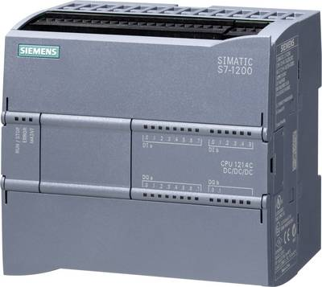
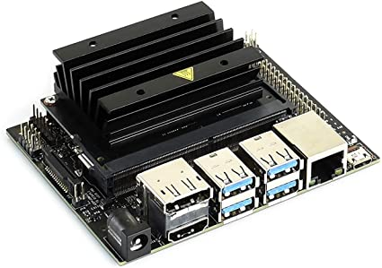
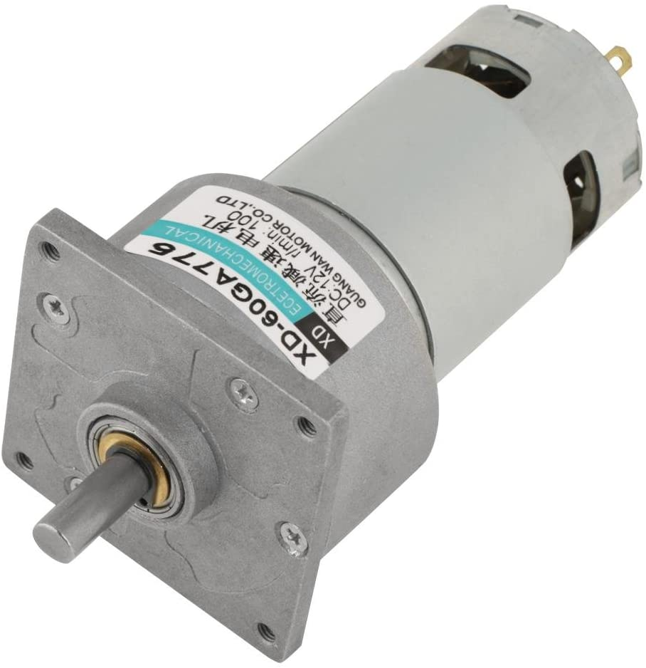
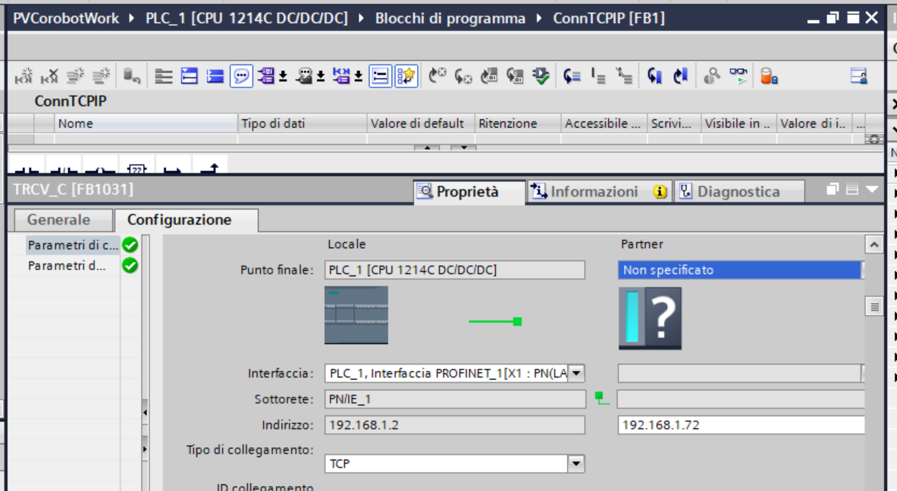
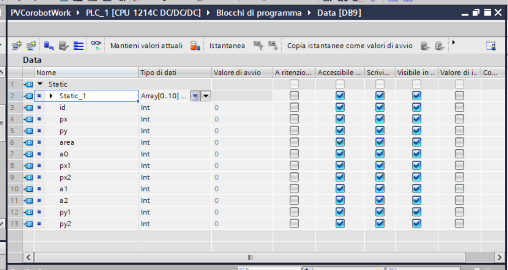

<b>IIS Galilei-Artiglio</b>

## Olimpiadi di Automazione Siemens

<b>Progetto PVCorobot</b>

PVCorobot è un robot collaborativo autocostruito con materiali di recupero e a basso costo, controllato da un PLC Siemens S71200 a seguito delle informazioni in tempo reale ricevute da una rete neurale installata su una GPU Jetson Nano. Di seguito il video di presentazione del progetto **VIDEO ISTITUZIONALE ANCORA DA CARICARE**
 
<html lang="it"> 

<body>
    

         <!-- finestra popup 3 -->
        
        

            

         <!-- il link you tube deve essere selezionato dal link di rete lasciando la cartella embed -->
		    <iframe width="614" height="345" src="https://www.youtube.com/embed/2P0j74Kl6sE" ></iframe>
            

            
        

       
    

</body>
</html>

Scopo del progetto è quello di rendere possibile la costruzione del robot da parte delle scuole utilizzando pezzi di tubo in PVC innestato in curve e TEE facilmente reperibili sul mercato o addirittura da sfridi, per realizzare un prodotto didattico avanzato e facilmente repricabile per piu' postazioni di lavoro. La tecnologia impiegata nel robot è di tutto riguardo trattandosi di tecnologia Siemens (Tia Portal, PLC S71200) abbinata ad una rete neurale in Python personalizzata che gira su una GPU Jetson Nano. Il robot è facilmente trasportabile e necessita solo dell'alimentazione elettrica e del collegamento ad internet che può anche avvenire via WiFi, avendo tutto l'occorrente (PLC, Jetson, Nano, router ecc.) "bordo macchina".
I motori per l'azionamento sono motoriduttori a 24V in DC controllati in PWM dal PLC Siemens. Si è scelto di usare dei motoriduttori in DC al posto di motori passo-passo proprio per esaltare il controllo che il PLC può svolge attraverso la rete neurale, avendo a riferimento il modello umano ovvero il cervello che comunica ai muscoli degli arti movimenti fluidi e continui e non del tipo "step by step".

## Pubblicazione su GitHub Pages
Le classi dell'[IIS Galilei-Artiglio](http://www.iisgalileiartiglio.gov.it/) hanno deciso di sviluppare il progetto su GitHub sostanzialmente per due motivi: per condividere uno spazio di lavoro comune tra Liceo ed ITI durante la realizzazione del robot e per condividere il lavoro finito con altre scuole e/o persone interessate. 
Questa modalità di condivisione non è "unidirezionale" tipica di un sito Web, perchè i file presenti nella repository permettono a chiunque di migliorare il progetto attraverso proposte, suggerimenti correzioni nello spirito di collaborazione proprio di [GitHub](https://guides.github.com/activities/hello-world/)

Per accedere al repository dei file clicca su [View On GitHub](https://github.com/iis-galilei-artiglio/Olimpiadi-Siemens-2021)

## Organizzazione e fasi di lavoro
Le classi che hanno partecipato al progetto sono la classe 4BS del Liceo Scientifico Tecnologico e le classi 4FT e 5CT del corso di Elettrotecnica/Elettronica.

La classe 4BS del Liceo si è occupata dell'addestramento della rete neurale mediante [Google Colaboratory](https://research.google.com/colaboratory/faq.html) mentre le classi ITI hanno collaborato nella realizzazione pratica del robot e nella programmazione del Tia Portal. E' evidente che la situazione legata al Covid ha influenzato non poco la costruzione del robot. Tuttavia l'IIS Galilei Artiglio ha attivato da subito lezioni in presenza alternate con lezioni in DAD per le classi 4BS e 4FT, mentre per la classe 5CT le lezioni sono sempre state in presenza. Per quanto riguarda l'addestramento della rete neurale, l'alternarsi di didattica in presenza ed a distanza non ha influenzato piu' di tanto i lavori degli studenti. Infatti Google Colab è uno strumento molto potente che può essere utilizzato da chiunque e con PC non particolarmente performanti. L'importante è avere un collegamento alla rete.

Circa invece la costruzione del robot in presenza, i docenti hanno mostrato come è possibile realizzare il montaggio del braccio con estrema semplicità trattandosi di normali tubi da innestare tra loro secondo uno schema stabilito.

La parte di programmazione con il Tia Portal è stata sviluppata in parte in presenza ed in parte in DAD.

## Costi e reperibilità online dei materiali
Il braccio di PVCorobot ha una estensione massima di circa 50cm ed è in grado di ruotare di 360°. Per renderlo facilmente trasportabile ed indipendente è stato inserito all'interno di un cestino metallico che funge anche da supporto per il PLC, la GPU e gli altri componenti. Al fine di facilitare la repricabilità del robot, di seguito sono riportati i link del materiale acquistato online. Naturalmente è solo un suggerimento, un'idea che si vuole comunicare, in quanto il progetto è fortemente personalizzabile e quindi migliorabile.

- PLC Siemens S71200 

- Jetson Nano

- Motoriduttore 24V

## Aspetti principali della comunicazione tra il PLC Siemens e Jetson Nano
La rete neurale presente su JN è in codice Python scaricabile direttamente dal repository. Per maggiori dettagli sull'addestramento della rete neurale si rimanda alla pagina di [NVIDIA JETSON](https://github.com/dusty-nv/jetson-inference).

La rete neurale è stata addestrata per il riconoscimento di un relè con probabilità di oltre il 50%

<html lang="it"> 

<body>
    

         <!-- finestra popup 3 -->
        
        

            

         <!-- il link you tube deve essere selezionato dal link di rete lasciando la cartella embed -->
		    <iframe width="430" height="241" src="images/scanrele.mp4" ></iframe>
            

            
        

       
    

</body>
</html>

Il collegamento tra JN e PLC avviene via LAN tramite TCP/IP dopo aver settato nel TIA Portal l'indirizzo del partner ovvero di JN

Le coordinate dell'immagine riconosciuta da JN sono inviate direttamente nel DataBase del PLC

Le informazioni che la rete neurale comunica al PLC sono sostanzialmente tre: la coordinata x e la coordinata y per la localizzazione del pezzo sul piano e l'area del box di riconoscimento per comunicare la profondità, ovvero l'asse z. Infatti all'avvicinarsi della webcam al relè, il rettangolo che delimita l'immagine riconosciuta aumenta e con esso l'area. Tra i vari studi condotti con il robot, uno in particolare è stato quello di capire se era possibile utilizzare la sola rete neurale come unico sensore di posizione, un pò come avviene per la vista degli esseri viventi. Questa possibilità oltre ad emulare il comportamento umano semplificherebbe la sensoristica del robot portando ad un risparmio economico oltre che verosimilmente a minori guasti e ad una manutenzione mirata alla sola webcam. Tuttavia si è potuto osservare che questo approccio dipende totalmente dalla bontà del modello addestrato che non deve presentare [overfitting e underfitting](https://en.wikipedia.org/wiki/Overfitting)

## Controllo vocale del PLC Siemens S71200
Il Web Server del PLC è utilizzato per attivare vocalmente il robot collaborativo. L'interfaccia vocale abbinata alla rete neurale che "vede" l'oggetto da afferrare, vuole spingere il progetto nel futuro dell'automazione. E' possibile interagire vocalmente con la pagina personalizzata del PLC cliccando su <a href="audio/corobot.html" target="_blank">Audio PVCorobot</a> 

## Attività di addestramento della rete neurale svolta dalla Classe 4BS Liceo Scientifico Tecnologico
Le ragazze ed i ragazzi del Liceo che hanno partecipato al progetto Siemens, hanno realizzato, **_in totale autonomia_**,  un [video](https://www.youtube.com/watch?v=2P0j74Kl6sE&feature=emb_imp_woyt) che, seppure con qualche imprecisione, fornisce la cifra dell'impegno dimostrato

