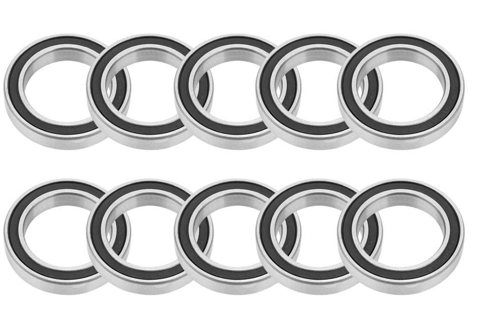
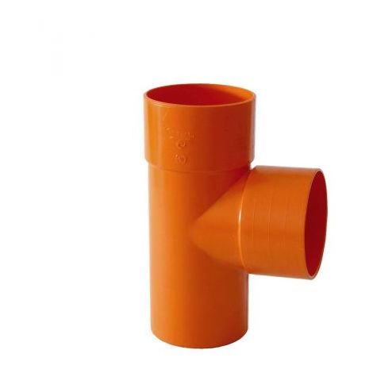
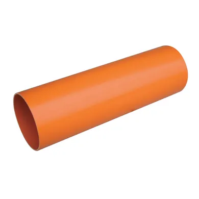
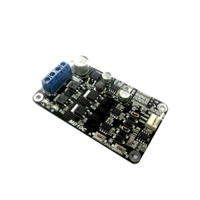

<b>IIS Galilei-Artiglio</b>

## Olimpiadi di Automazione Siemens

<b>Progetto PVCorobot</b>

PVCorobot è un robot collaborativo autocostruito con materiali di recupero e a basso costo, controllato da un [PLC Siemens S71200](https://cache.industry.siemens.com/dl/files/593/109741593/att_895892/v1/s71200_system_manual_it-IT_it-IT.pdf) a seguito delle informazioni in tempo reale ricevute da una rete neurale in linguaggio [Python](https://www.python.org/) installata su una [GPU Jetson Nano](https://www.nvidia.com/it-it/autonomous-machines/embedded-systems/jetson-nano/product-development/).  
 
Scopo del progetto è quello di far interagire una rete neurale addestrata dagli studenti con un PLC S7 1200. L'utilizzo dell'AI prevede sia l'interazione vocale che visiva al fine di svolgere compiti sufficientemente complessi in ambito dell'automazione industriale, ma anche in ambito impiantistico in genere come proposto nel caso studio. Per rendere possibile questa alchimia e per suscitare l'interesse negli studenti, è stato costruito un robot utilizzando pezzi di tubo in PVC innestato in curve e TEE facilmente reperibili sul mercato o addirittura da sfridi, in modo da realizzare un prodotto didattico avanzato e facilmente repricabile per piu' postazioni di lavoro. La tecnologia impiegata nel robot è di tutto riguardo trattandosi di tecnologia Siemens (Tia Portal, PLC S7 1200) abbinata ad una rete neurale in Python personalizzata che gira su una GPU Jetson Nano. Il robot è facilmente trasportabile e necessita solo dell'alimentazione elettrica e del collegamento ad internet che può anche avvenire via WiFi, avendo tutto l'occorrente (PLC, Jetson, Nano, router ecc.) "bordo macchina". L'IIS Galilei Artiglio mette a disposizione delle scuole interessate l'intero progetto su GitHub.

I motori per l'azionamento sono motoriduttori a 24V in DC controllati in PWM dal PLC Siemens. Si è scelto di usare dei motoriduttori in DC al posto di motori passo-passo proprio per esaltare il controllo che il PLC può svolgere attraverso la rete neurale, avendo a riferimento il modello umano ovvero il cervello che comunica ai muscoli degli arti movimenti fluidi e continui e non del tipo "step by step".

**VIDEO PVCorobot**
<html lang="it"> 
<body>
    

         <!-- finestra popup 3 -->
        
        

            

         <!-- il link you tube deve essere selezionato dal link di rete lasciando la cartella embed -->
		    <iframe width="614" height="345" src="https://youtube.com/embed/9PIdQX3Li60" ></iframe>
            

            
        

    

</body>
</html>

## Caso studio

Una realtà produttiva importante dell'alta versilia è il settore lapideo. L'azienda [Cemenbit](https://www.cemenbit.it/) tra le varie attività produce inerti che sono trasportati mediante specifici automezzi dal luogo di produzione ai vari clienti che ne fanno richiesta. Il materiale estratto dalla cava è dapprima frantumato, successivamente viene lavato ed infine stoccato in apposite aree e suddiviso per caratteristiche e dimensione. Il lavaggio è fatto direttamente a bordo dei cassoni dei camion attraverso un sistema di spruzzatori comandati da due fotocellule poste all'altezza della cabina di guida. L'autista dapprima accede alla pesa per determinare il quantitativo caricato e successivamente ottiene il via libera per spostarsi sotto il sistema di spruzzatori. Un semaforo verde controllato da fotocellule e temporizzatore, comunica all'autista l'avvenuto lavaggio. 

Questa fase appena descritta contiene delle criticità per l'azienda. Infatti le condizioni meteo e la composizione del prodotto caricato nel cassone, modificano il tempo necessario per il lavaggio dell'inerte con il risultato che il verde semaforico non corrisponde sempre con il termine del ciclo di lavaggio. Ciò comporta che a volte il camion parte dalla stazione di lavaggio con un getto di acqua e fango che continua ad uscire dalla fessura posteriore del cassone, oppure può accadere che in certe condizioni climatiche e di prodotto, il materiale venga lavato completamente e il getto di acqua posteriore risulti chiaro ma gli spruzzatori continuano ad irrorare il cassone seguendo il tempo di ciclo impostato. 

In altre parole occorre un sistema di lavaggio intelligente, capace di capire quando è necessario interrompere il flusso d'acqua degli spruzzatori ed attivare la sequenza semaforica, in modo da ottimizzare il risparmio energetico ed i tempi di produzione. Questo può essere fatto addestrando una rete neurale in grado di riconoscere la torbidità del flusso di acqua e fango uscente dal lato posteriore del cassone e aseguito del lavaggio dell'inerte ([Nota](#nota)).

Gli studenti dell'IIS Galilei Artiglio hanno inoltre pensato di realizzare un pittogramma da fissare su ciascun camion, in modo da costituire una sorta di codice a barre. In questo scenario il binomio rete neurale-pittogramma non solo controlla attraverso il PLC il lavaggio, ma consente di avere informazioni in tempo reale circa i camion presenti in cava, il numero di consegne giornaliere per ciascuna unità, i tempi di consegna ecc. e fare stime programmate sulla manutenzione degli autocarri. 

Il pittogramma può essere una valida alternativa al servizio [Google Api developer](https://console.developers.google.com) in cui è possibile realizzare un progetto di Cluod Vision API per il riconoscimento di targhe di autoveicoli. 

Apparentemente il caso studio sembra non avere elementi in comune con il controllo di un robot ad uso didattico. In realtà è vero l'opposto. Addestrare una rete neurale su oggetti personalizzati, ricavare le informazioni utili dall'oggetto riconosciuto e trasferirle al PLC Siemens S7 1200 per il controllo delle azioni da compiere è un metodo, un approccio generale che sta alla base del connubio AI-PLC. Potremmo certamente dire che in termini di programmazione Python-KOP-SCL-FUP, il caso studio è un caso particolare del caso piu' generale denominato PVCorobot.  

## Pubblicazione su GitHub Pages
Le classi dell'[IIS Galilei-Artiglio](http://www.iisgalileiartiglio.gov.it/) hanno deciso di sviluppare il progetto su GitHub sostanzialmente per due motivi: per condividere uno spazio di lavoro comune tra Liceo ed ITI durante la realizzazione del robot e per condividere il lavoro finito con altre scuole e/o persone interessate. 
Questa modalità di condivisione non è "unidirezionale" tipica di un sito Web, perchè i file presenti nella repository permettono a chiunque di migliorare il progetto attraverso proposte, suggerimenti correzioni nello spirito di collaborazione proprio di [GitHub](https://guides.github.com/activities/hello-world/)

Per accedere al repository dei file clicca su [View On GitHub](https://github.com/iis-galilei-artiglio/Olimpiadi-Siemens-2021)

## Organizzazione e fasi di lavoro
Le classi che hanno partecipato al progetto sono la classe 4BS del Liceo Scientifico Tecnologico e le classi 4FT e 5CT del corso di Elettrotecnica/Elettronica.

La classe 4BS del Liceo si è occupata dell'addestramento della rete neurale mediante [Google Colaboratory](https://research.google.com/colaboratory/faq.html) mentre le classi ITI hanno collaborato nella realizzazione pratica del robot e nella programmazione del Tia Portal. E' evidente che la situazione legata al Covid ha influenzato non poco la costruzione del robot. Tuttavia l'IIS Galilei Artiglio ha attivato da subito lezioni in presenza alternate con lezioni in DDI per le classi 4BS e 4FT, mentre per la classe 5CT le lezioni sono state quasi sempre in presenza, fatta eccezione per due brevi periodi di lockdown locali e regionali. Per quanto riguarda l'addestramento della rete neurale, l'alternarsi di didattica in presenza ed a distanza non ha influenzato piu' di tanto i lavori degli studenti. Infatti Google Colab è uno strumento molto potente che può essere utilizzato da chiunque e con PC non particolarmente performanti. L'importante è avere un collegamento alla rete.

Circa invece la costruzione del robot, i docenti hanno mostrato sia in presenza sia a distanza come è possibile realizzare il montaggio del braccio con estrema semplicità trattandosi di normali tubi da innestare tra loro secondo uno schema stabilito.

La parte di programmazione con il Tia Portal è stata sviluppata in parte in presenza ed in parte in DDI.

#### Nota
Il rammarico dei docenti che hanno svolto l'attività di tutoraggio del progetto, è stato quello di non poter accompagnare, causa COVID, gli studenti presso l'azienda CEMENBIT che si è resa disponibile a collaborare al caso studio. Non è stato possibile infatti girare dei filmati e scattare foto sul grado di torbidità del flusso d'acqua uscente dai cassoni per tentare di addestrare una rete neurale al "lavaggio intelligente". 

## Costi e reperibilità online dei materiali
Il braccio di PVCorobot ha una estensione massima di circa 50cm ed è in grado di ruotare di 360°. Per renderlo facilmente trasportabile ed indipendente è stato inserito all'interno di un cestino metallico che funge anche da supporto per il PLC, la GPU e gli altri componenti. Al fine di facilitarne la repricabilità, di seguito sono riportati i link del materiale acquistato online. Naturalmente è solo un suggerimento, un'idea che si vuole comunicare, in quanto il progetto è fortemente personalizzabile e quindi migliorabile.

- [PLC Siemens S71200](https://mall.industry.siemens.com/mall/it/it/Catalog/Products/10045652)

- [NVIDIA Jetson Nano](https://www.amazon.it/owootecc-Developer-Versione-alimentazione-parallelo/dp/B081CN3VB1/ref=sr_1_4?__mk_it_IT=%C3%85M%C3%85%C5%BD%C3%95%C3%91&crid=1GEAXFX67NZA3&dchild=1&keywords=jetson+nano&qid=1614870928&sprefix=Jetson+nano%2Cindustrial%2C759&sr=8-4)

- [Motoriduttore 24V](https://www.amazon.it/motoriduttore-XD-42GA775-Motoriduttore-regolabile-caratteristiche/dp/B07RSYGS7R/ref=dp_prsubs_2?pd_rd_i=B07RSYGS7R&psc=1)

- [Cestino di contenimento](https://www.amazon.it/gp/product/B088BKHFNK/ref=ppx_yo_dt_b_asin_title_o01_s00?ie=UTF8&psc=1)

- [Cuscinetti D.40](https://www.amazon.it/gp/product/B07RLXCZJH/ref=ppx_yo_dt_b_search_asin_image?ie=UTF8&psc=1)

- [TEE PVC D.40](https://www.manomano.it/catalogue/p/tee-braga-in-pvc-arancio-rosso-derivazione-a-87-diam40-mm-acqua-fogna-14662293#/)

- [Tubo PVC D.40](https://www.manomano.it/p/tubo-in-pvc-arancio-14757608?model_id=17947413)

- [Driver per motori DC](https://www.futurashop.it/driver-per-1-motore-dc-10-a-1686-md10c?search=1686-MD10C)

## Aspetti principali della comunicazione tra il PLC Siemens e Jetson Nano
La rete neurale presente su JN è in codice Python scaricabile direttamente dal repository. Per maggiori dettagli sull'addestramento della rete neurale si rimanda alla pagina di [NVIDIA JETSON](https://github.com/dusty-nv/jetson-inference).

La rete neurale è stata addestrata per il riconoscimento di un relè con probabilità di oltre il 50%

<html lang="it"> 

<body>
    

         <!-- finestra popup 3 -->
        
        

            

         <!-- il link you tube deve essere selezionato dal link di rete lasciando la cartella embed -->
		    <iframe width="430" height="241" src="images/scanrele.mp4" ></iframe>
            

            
        

       
    

</body>
</html>

Il collegamento tra JN e PLC avviene via LAN tramite TCP/IP dopo aver settato nel TIA Portal l'indirizzo del partner ovvero di JN

Le coordinate dell'immagine riconosciuta da JN sono inviate direttamente nel DataBase del PLC

Le informazioni che la rete neurale comunica al PLC sono sostanzialmente tre: la coordinata x e la coordinata y per la localizzazione del pezzo sul piano e l'area del box di riconoscimento per comunicare la profondità, ovvero l'asse z. Infatti all'avvicinarsi della webcam al relè, il rettangolo che delimita l'immagine riconosciuta aumenta e con esso l'area. Tra i vari studi condotti con il robot, uno in particolare è stato quello di capire se era possibile utilizzare la sola rete neurale come unico sensore di posizione, un pò come avviene per la vista degli esseri viventi. Questa possibilità oltre ad emulare il comportamento umano semplifica la sensoristica del robot portando ad un risparmio economico oltre che verosimilmente a minore probabilità di guasti e ad una minore manutenzione non avendo sensori di alcun genere se non la sola webcam. Tuttavia si è potuto osservare che questo approccio dipende totalmente dalla bontà del modello addestrato che non deve presentare [overfitting e underfitting](https://en.wikipedia.org/wiki/Overfitting)

## Controllo vocale del PLC Siemens S71200
Il Web Server del PLC è utilizzato per attivare vocalmente il robot collaborativo. L'interfaccia vocale abbinata alla rete neurale che "vede" l'oggetto da afferrare, vuole spingere il progetto nel futuro dell'automazione. E' possibile interagire vocalmente offline con la pagina personalizzata del PLC cliccando su [Audio PVCorobot](https://www.albertodelcarlo.it/PVCo/crbot.html). Il controllo vocale online del PLC S7 1200 non consente l'avvio del robot se prima non si è chiesto di riconoscere l'oggetto. 
Anche in questo caso il file audio in HTML è condiviso e può essere scaricato e personalizzato da chiunque.

## Attività di addestramento della rete neurale Classe 4BS Liceo Scientifico Tecnologico
Le ragazze ed i ragazzi del Liceo che hanno partecipato al progetto Siemens, hanno realizzato, **_in totale autonomia_**,  un [video](https://www.youtube.com/watch?v=2P0j74Kl6sE&feature=emb_imp_woyt) che, seppure con qualche imprecisione, fornisce la cifra dell'impegno dimostrato

